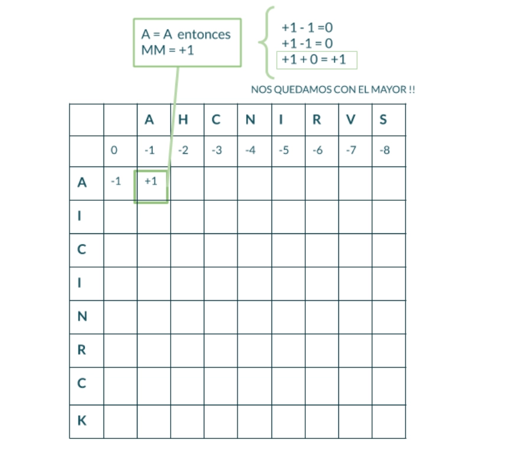
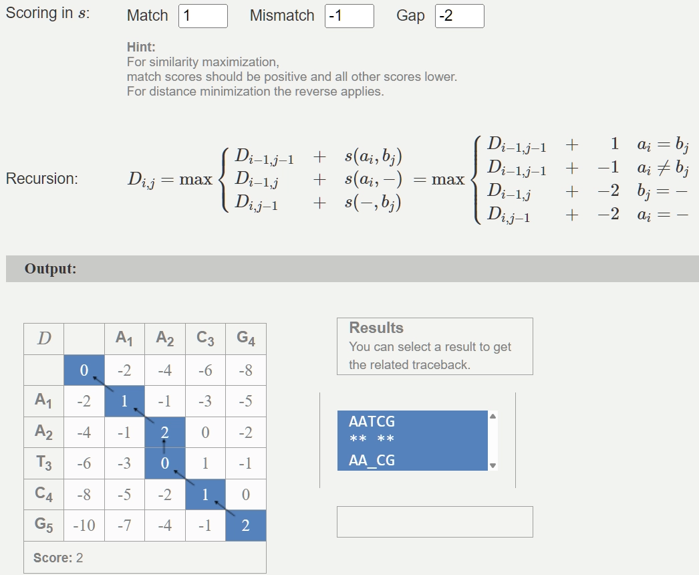
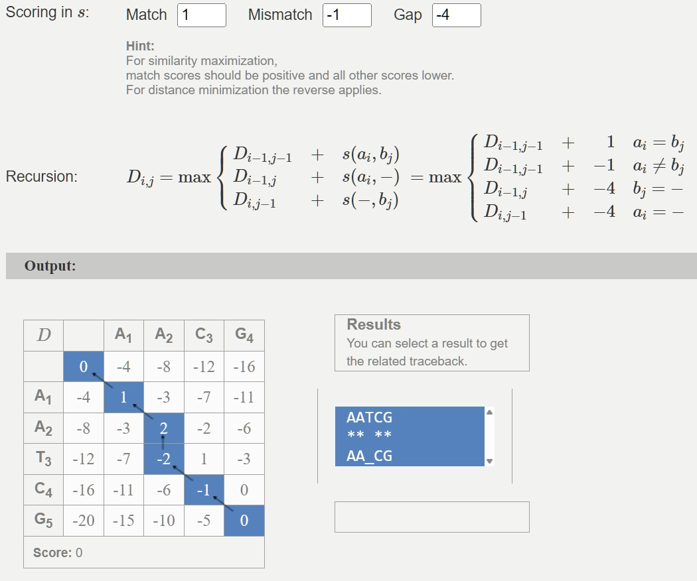
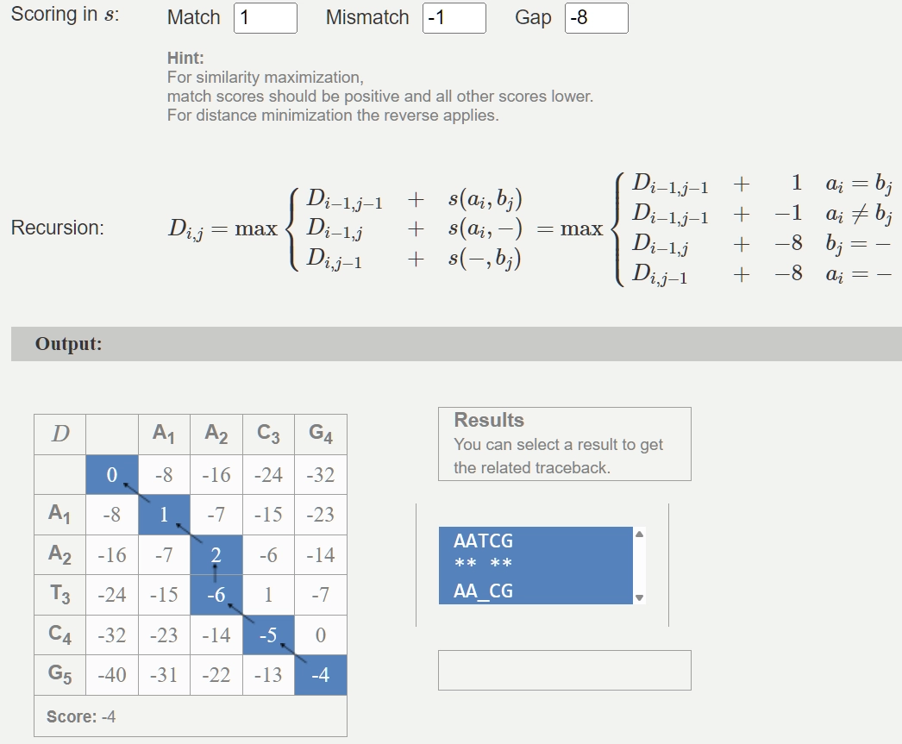
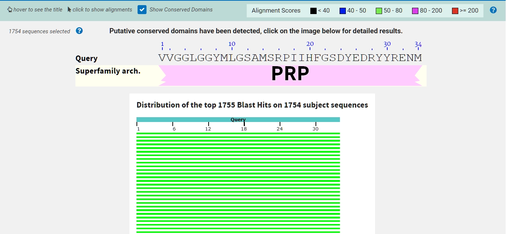
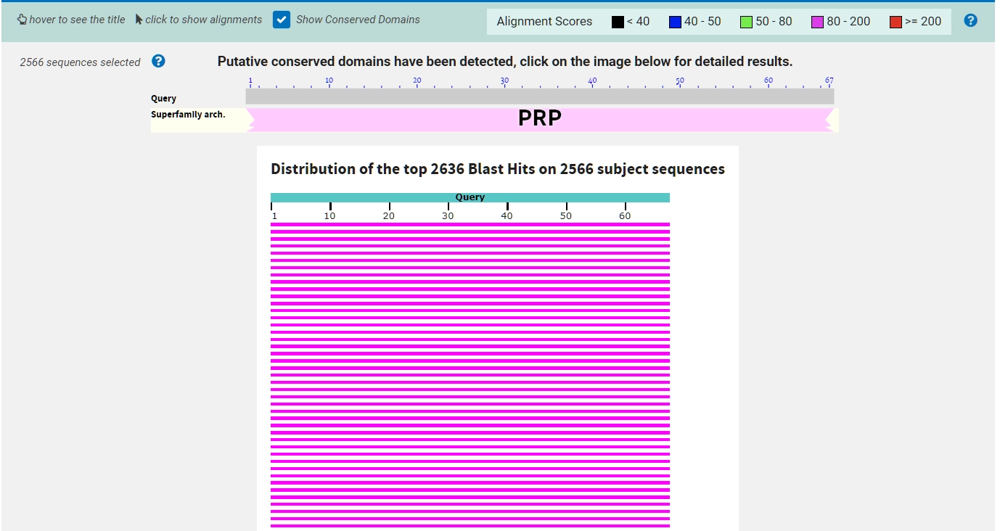
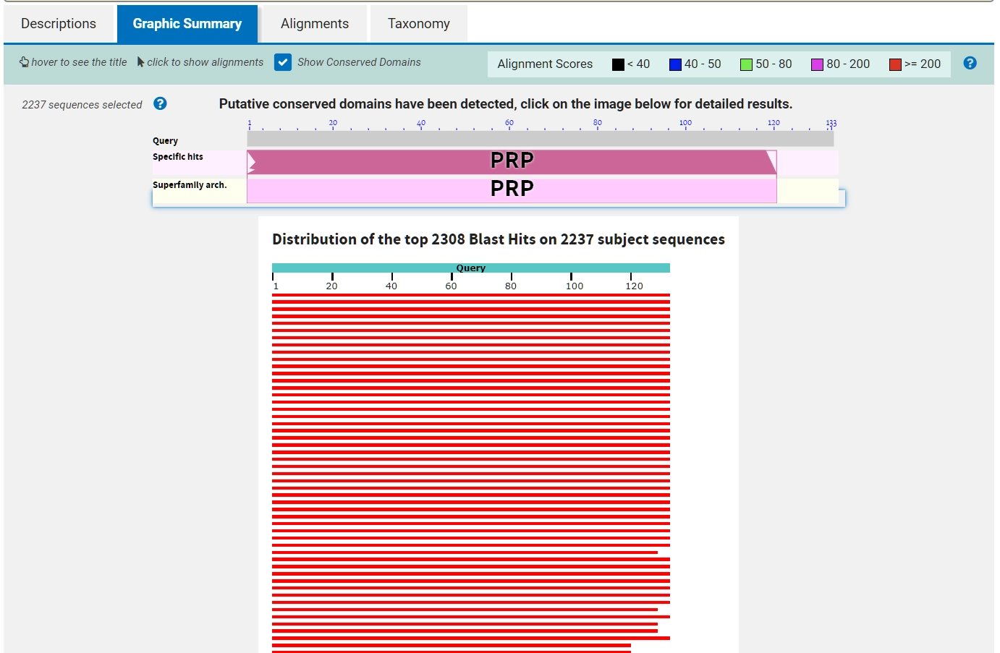

> ¿Qué tipo de información se puede extraer de la comparación de secuencias?
> 

Imagino que más que nada ver que patrones se encuentran entre las secuencias comparadas y si conocemos información sobre sobre su comportamiento bioquimico o como intervienen en la expresión génica se podría entender mejor como se relacionan las mismas y que grado de similitud comparten.

> ¿Cómo esperás que se vea en una comparación?
> 

Pienso que depende mucho del tipo de comparación que se quiera hacer, por el titulo del documento infiero que son alineamientos secuenciales (lineales) es decir emparejando 1 a uno o linealmente con adiciones o deleciones a las secuencias. 

> ¿Por qué crees que es mejor evaluar las relaciones evolutivas lejanas comparando proteínas?
> 

Creo que es porque como vimos anteriormente una proteína puede ser sintetizada por distintas secuencias, de forma tal que una comparación de secuencias a nivel de ácidos nucleicos podría dar falsos negativos sobre la relación entre los genes.

> DESAFIO III: Probá en tabla interactiva distintos alineamientos para las palabras "ANA" y "ANANA". Verás que en el margen superior izquierdo aparece un valor de identidad calculado para cada alineamiento que intentes y un botón para cambiar la penalidad que se le otorga a dicho para el cálculo de identidad. Probá varias combinaciones, tomá nota de los valores de identidad observados y de las conclusiones que se desprendan de estas observaciones.
> 

> ¿Cómo se relacionan los valores de identidad obtenidos con las penalizaciones que se imponen al gap? ¿Qué implicancias crees que tiene una mayor penalización de gaps? ¿Se te ocurre alguna otra forma de penalización que no haya sido tenido en cuenta en este ejemplo?
> 

La mayor penalización a los gaps indica que en la realidad estaríamos añadiendo o quitando aminoácidos a las secuencias y esto potencialmente podría influir en su comportamiento en general resultante de la secuencia. Por ejemplo a la hora de intentar sintetizar una proteína.

Un posible caso que se podría evaluar penalizar es si las secuencias coinciden o no con el inicio o el final.  Es decir penalizar mas cuando las secuencias estan “descentradas”.

> Entonces, pensando en un alineamiento de ácidos nucleicos ¿Cuáles te parece que son las implicancias de abrir un gap en el alineamiento? ¿Qué implicaría la inserción o deleción de una región de más de un residuo?
> 

Lo mismo que ya comente antes, potencialmente podria afectar al proceso de sintetización y plegado de las proteinas por decir algo.

> DESAFIO IV: En la siguiente tabla probá distintos alineamientos para las secuencias nucleotídicas. Podrás ver las traducciones para cada secuencia. Probá varias combinaciones, tomá nota de las observaciones y de las conclusiones que se desprendan de estas. Consigna: Alineá "TGCGAGG" y "TGCCGAAGG" y mirá las traducciones
> 

> ¿Dá lo mismo si el gap que introducís cae en la primera, segunda o tercer posición del codón? ¿Cómo ponderarías las observaciones de este ejercicio para evaluar el parecido entre dos secuencias?
> 

No, al parecer si el gap va en cualquiera de las posiciones no cambia la identidad sean o no coincidentes. Lo que infuye es la cantidad de gaps.

> DESAFIO V: Estuvimos viendo que el alineamiento de secuencias no es trivial y requiere contemplar los múltiples caminos posibles, teniendo en cuenta al mismo tiempo la información biológica que restringe ese universo de posibilidades.
> 

¡Es momento de llevar entonces estos conceptos a lo concreto!

Te proponemos pensar los pasos a seguir en un alineamiento de dos secuencias cortas, teniendo en cuenta una matriz genérica de scoring (puntuación) que contemple las complejidades que estuvimos viendo, es decir que penalice de distinto modo una inserción o deleción, que una discordancia (mismatch) o una coincidencia (match). Escribilos o esquematizalos en un diagrama de flujo.

> **PARA PENSAR**: ¿En qué consiste la programación dinámica? ¿Por qué crees que es útil en este caso?
> 

Veamos un poco más al detalle cómo funciona el algoritmo de **Needleman-Wunsch**. Como bien dijimos anteriormente, este es un procedimiento que consiste en buscar series de caracteres individuales que se encuentran en el mismo orden en las secuencias a comparar, colocándolas de modo de maximizar su similitud. Este funciona en base a un sistema de puntuaciones de cuán parecidas son dos secuencias. Este algoritmo calcula secuencialmente para cada posición de la matriz un puntaje que deriva de buscar el mayor score entre los posibles scores calculados como la suma de una celda adyacente, más el match/mismatch (MM) de la celda actual, valor que se obtiene utilizando las matrices de sustitución que introdujimos anteriormente. Se derivan, entonces, los siguientes valores:

- MM + Score de la celda superior
- MM + Score de la celda izquierda
- MM + Score de la celda superior izquierda



En mi caso no hice el diagrama de flujo sino el pseudo codigo de como creo que quedaria el algoritmo

<aside>
⚠️

Disclaimer: El pseudocodigo propuesto no aplica ninguna tecnica especifica de optimizacion, sirve solamente a modo de ejemplo de como me imagino el algoritmo

</aside>

```jsx
función AlinearGlobal(S1, S2, gap_penalty, scoring):
    // scoring(letra1, letra2) → devuelve +2 (match) o -1 (mismatch)
    
    m = matriz (len(S1)+1) × (len(S2)+1)
    
    // Inicializamos la matriz con los score de los gaps
    m[0][0] = 0
    para i = 1 hasta len(S1): m[i][0] = m[i-1][0] + gap_penalty
    para j = 1 hasta len(S2): m[0][j] = m[0][j-1] + gap_penalty
    
    // Llenado de la matriz
    para i = 1 hasta len(S1):
        para j = 1 hasta len(S2):
            diag = m[i-1][j-1] + scoring(S1[i], S2[j])
            up   = m[i-1][j]   + gap_penalty
            left = m[i][j-1]   + gap_penalty
            m[i][j] = max(diag, up, left)
    
    // Construimos las secuencias alineadas
    alineamiento1 = ""
    alineamiento2 = ""
    i = len(S1)
    j = len(S2)
    
    mientras i > 0 o j > 0:
        si i > 0 y j > 0 y m[i][j] == m[i-1][j-1] + scoring(S1[i], S2[j]):
            // Diagonal
            alineamiento1 = S1[i] + alineamiento1
            alineamiento2 = S2[j] + alineamiento2
            i = i - 1
            j = j - 1
        sino si i > 0 y m[i][j] == m[i-1][j] + gap_penalty:
            // Gap en Secuencia 2
            alineamiento1 = S1[i] + alineamiento1
            alineamiento2 = "-" + alineamiento2
            i = i - 1
        sino:
            // Gap en Secuencia 1
            alineamiento1 = "-" + alineamiento1
            alineamiento2 = S2[j] + alineamiento2
            j = j - 1
    
    score = m[len(S1)][len(S2)]
    retornar (alineamiento1, alineamiento2, score)
```

> 
> 
> 
> 🧗🏻‍♀️DESAFIO VI: Utilizando la herramienta interactiva desarrolladas por el Grupo de Bioinformática de Freiburg probá distintos Gap penalties para el ejemplo propuesto y observá lo que ocurre.
> 
> Interpretando la recursión, explicá con tus palabras de dónde salen los valores de la matriz que se construye. ¡Esquematiza tus conclusiones!
> 

Si lo analizamos a alto nivel sin pensar tanto, si el gap penalty es muy alto la matriz va a tender a ponderar como mejor opción un mismatch/match sobre un gap. Lo que podria hacer que por ejemplo dos secuencias con muchos mismatches tenga un puntaje más alto que si hubiéramos elegido un score para el gap menos agresivo.

Con la configuración por defecto el score obtenido es 2


Otro análisis interesante es que si el gap se mantiene negativo el camino más eficiente no cambia







> ¿En qué casos serán de utilidad uno u otro tipo de alineamientos? ¿Qué limitaciones tendrá cada uno?
> 

La medida de similitud entre dos secuencias entiendo que nos sirve más para cuando se requiere analizar secuencias largas que implican muchas combinaciones probables y por ende más tiempo para generar la matriz.

Por el contrario el alineamiento múltiple servirá para analizar de forma superficial y encontrar dado un conjunto de secuencias las que son más similares entre si, pero con secuencias más cortas para poder generar de forma más rápida las matrices.

> 
> 
> 
> **PARA PENSAR** 🤔: Ingresá al servidor del NCBI y mirá los distintos programas derivados del BLAST que se ofrecen ¿Para qué sirve cada uno? ¿En qué casos usarías cada uno?
> 
> Vamos a explorar esta herramienta!
> 
> 🧗🏻‍♀️DESAFIO VII: calculá el E-value y % identidad utilizando el programa Blast de la siguiente secuencia input usando 20000 hits, un e-value de 100 y tomando aquellos hits con un mínimo de 70% cobertura. Observe y discuta el comportamiento de : E-value vs. % id, Score vs % id, Score vs E-value
> 
> VVGGLGGYMLGSAMSRPIIHFGSDYEDRYYRENMHRYPNQVYYRPMDEYSNQNNFVHDCVNITIKQHTVTTTTKGENFTETDVKMMERVVEQMCITQYERESQAYYQRGSSMVLFSSPPVILLISFLIFLIVG
> 

Cuanto mas alto es el score mas alto tiende a ser el % de identidad aunque no parece ser una relación totalmente lineal.  Por otro lado cuanto mas chico es el E-value mas alto es el score. Y cuanto mas chico el E-value  mas alto suele ser el % de identidad (aunque de nuevo no parece ser una correlación total pero se nota la tendencia).

Un registro cada vez que baja 1 el exponente de e-value según la secuencia que se pidió analizar

| Score | E-value | % Identity |
| --- | --- | --- |
| 281 | 1e-94 | 100.00% |
| 281 | 2e-93 | 99.25% |
| 279 | 1e-92 | 98.50% |
| 276 | 2e-91 | 96.99% |
| 274 | 1e-90 | 96.24% |
| 268 | 3e-88 | 96.90% |
| 264 | 9e-87 | 90.23% |
| 258 | 2e-84 | 100.00% |
| 255 | 1e-83 | 95.24% |
| 254 | 1e-82 | 94.44% |
| 251 | 1e-81 | 91.27% |
| 249 | 1e-80 | 90.48% |
| 246 | 1e-79 | 89.68% |
| 244 | 1e-78 | 88.10% |
| 241 | 1e-77 | 88.28% |
| 237 | 1e-76 | 90.00% |
| 231 | 1e-75 | 99.10% |
| 233 | 1e-74 | 85.83% |
| 231 | 1e-73 | 84.25% |
| 228 | 1e-72 | 83.33% |
| 226 | 1e-71 | 80.95% |
| 224 | 1e-70 | 80.16% |
| 220 | 1e-69 | 86.73% |
| 218 | 1e-68 | 84.92% |
| 216 | 1e-67 | 84.25% |
| 213 | 1e-66 | 84.75% |
| 211 | 1e-65 | 83.04% |
| 207 | 1e-64 | 87.39% |
| 206 | 1e-63 | 83.33% |
| 204 | 1e-62 | 82.54% |
| 201 | 1e-61 | 79.37% |
| 194 | 1e-60 | 90.72% |
| 191 | 1e-59 | 88.66% |
| 191 | 1e-58 | 90.62% |
| 189 | 1e-57 | 88.54% |
| 187 | 1e-56 | 80.70% |
| 184 | 1e-55 | 81.10% |
| 182 | 1e-54 | 76.32% |
| 182 | 1e-53 | 82.18% |
| 178 | 1e-52 | 75.22% |
| 172 | 1e-51 | 81.82% |
| 173 | 1e-50 | 76.36% |

> 
> 
> 
> Veamos ahora qué pasa cuando usamos sólo fragmentos de nuestra secuencia problema:
> 
> 🧗🏻‍♀️DESAFIO VIII: Realizá nuevas búsquedas usando la mitad de la secuencia problema y para un cuarto de la secuencia original. Compará los gráficos obtenidos. ¿Qué conclusiones puede sacas?
> 



Grafico para un cuarto de la secuencia



Grafico para la mitad de la secuencia



Grafico para la secuencia completa

Se ve que el scoring para los diferentes alineamientos fue disminuyendo cuanto mas corta fue la secuencia analizada. Y lo mismo para la cantidad de hits registrados.

> 
> 
> 
> 🧗🏻‍♀️DESAFIO IX: Utilizando BLAST utilice búsquedas de similitud secuencial para identificar a la siguiente proteína:
> 
> MIDKSAFVHPTAIVEEGASIGANAHIGPFCIVGPHVEIGEGTVLKSHVVVNGHTKIGRDNEIYQFASIGEVNQDLKYAGEPTRVEIGDRNRIRESVTIHRGTVQGGGLTKVGSDNLLMINAHIAHDCTVGNRCILANNATLAGHVSVDDFAIIGGMTAVHQFCIIGAHVMVGGCSGVAQDVPPYVIAQGNHATPFGVNIEGLKRRGFSREAITAIRNAYKLIYRSGKTLDEVKPEIAELAETYPEVKAFTDFFARSTRGLIR
> 
> **PARA PENSAR** 🤔: ¿Cuál es la función de la proteína? ¿A qué grupo taxonómico pertenece? A un nivel de significancia estadística adecuado ¿Cuántas secuencias similares se encuentran?
> 

La proteína pertenece al grupo de las bacterias, específicamente a la familia Enterobacteriaceae. La mayoría de las secuencias más similares corresponden a Escherichia coli, aunque también aparecen otras bacterias del mismo grupo como Citrobacter, Enterobacter y Klebsiella. Ademas se encuentran miles de secuencias similares.

> 🧗🏻‍♀️DESAFIO X: Realizá una nueva corrida del BLASTp, utilizando la misma secuencia , pero ahora contra la base de datos PDB. ¿Se obtienen los mismos resultados? ¿Qué tipo de resultados(hits) se recuperan? ¿Cuándo nos podría ser útil este modo de corrida?
> 

No, los resultados no son los mismos. Los resultados coinciden con la taxonomia de`Escherichia coli K-12`. Y solo aparecen 34 resultados (y solo 31 con E-value significativo).

Se me ocurre que esto podría ser útil correr en esta base de datos cuando queremos tratar de tener un análisis rapido de alineamientos. Ya que la base de PBD es mas chica que otras en comparación (por ej. UniProtKB o NCBI RefSeq).