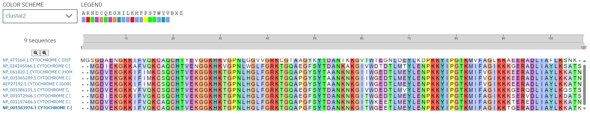

# En que se parecen un pollo y una mosca

### ¿Cuán sencillo será alinear dos o más secuencias a mano?

Dependiendo de la longitud  y la cantidad de secuencias podria ser humanamente posible hacerlo a mano. Pero entiendo que a medida que necesitamos alinear multiples secuencias largas se empieza a complicar por la cantidad de combinaciones que se podrian generar añadiendo gaps entre cada aminoacido que la compone y hacer el respectivo calculo que nos permita conocer la similitud.

### ¿Cuánto influirán el número de secuencias a alinear, su longitud, y la similitud entre ellas?

Por logica la similitud debería ir en detrimento cuando mayor se la cantidad de secuencias a alinear  y lo mismo para la longitud. Ya que aumenta exponencialmente la cantidad de combinaciones de gaps posibles para diferentes configuraciones.

Más precisamente la probabilidad de que 2 aminoacidos coincidan es de $1/20$ es decir 5%. Y la probabilidad de que 2 secuencias de aminoácidos de longitud 2 es de $0,25%%$% o $1/400$.

Esto obviamente es con un modelo muy simple ya que habría que tener en cuenta si existen relaciones en las apariciones de ciertos aminoácidos en las secuencias lo que cambia el calculo de la probabilidad de similitud. O por ejemplo que puede ocurrir que las secuencias que estemos comparando no sean de la misma longitud.

### ¿Son parecidos los citocromos c de humano y gallo?

Si alineamos las cadenas ambas desde el inicio coinciden en 94 de 107 veces.

```haskell
MGDVEKGKKIFIMKCSQCHTVEKGGKHKTGPNLHGLFGRKTGQAPGYSYTAA
NKNKGIIWGEDTLMEYLENPKKYIPGTKMIFVGIKKKEERADLIAYLKKATNE
...-.......--...............................-.-...-.
......-........................-.....-..-.......-..--
MGDIEKGKKIFVQKCSQCHTVEKGGKHKTGPNLHGLFGRKTGQAEGFSYTDA
NKNKGITWGEDTLMEYLENPKKYIPGTKMIFAGIKKKSERVDLIAYLKDATSK
```

No tengo una definicion de parecido pero diria que si si coinciden en más el 84% de la secuencia.

### ¿Qué teorías subyacen a este análisis?

Segun lo que vimos en la cursada la Teoria de la Evolución de Darwin y la Teoría Endosimbiótica de Margulis

### ¿Cómo nos ayuda la evolución a explicar sus similitudes y diferencias?

Conectar con la relacion de la `cytochrome c` con su rol en la respiración y el como esto obliga a que ciertos razgos o capacidades se tengan que mantener de especie en especie ya que es un factor importante para la vida.

## Comparamos secuencias



### ¿Qué indican los colores?

Se agrupan los aminoacidos segun sus propiedades quimicas

**Azul claro:** `A`, `I`, `L`, `M`, `F`, `W`, `V`. Aminoácidos **hidrofóbicos (no polares)**. Estos suelen esconderse en el interior de la estructura para no tocar el medio acuoso de la célula.

**Rojo:** `R` (Arginina) y `K` (Lisina). Aminoácidos que tienen **carga eléctrica positiva**.

**Magenta:** `D` (Ácido Aspártico) y `E` (Ácido Glutámico). Aminoácidos ácidos que tienen **carga eléctrica negativa**. Los rojos y los magentas suelen atraerse para darle estabilidad a la proteína!).

**Verde:** `N`, `Q`, `S`, `T`. Son aminoácidos **polares pero sin carga** (hidrofílicos). Les gusta interactuar con el agua y suelen estar en la superficie exterior de la proteína.

**Amarillo:** `P` (Prolina). Su estructura es un anillo rígido que obliga a la cadena de la proteína a doblarse fuertemente.

**Naranja:** `G` (Glicina). El aminoácido más chiquito de todos. Al no tener casi volumen, funciona como una articulación libre, dándole muchísima flexibilidad a la cadena en ese punto exacto.

**Rosa:** `C` (Cisteína). Contiene azufre y puede formar algo llamado "puentes disulfuro", que son como grapas químicas súper fuertes que fijan la estructura de la proteína.

**Cian:** `H` (Histidina) y `Y` (Tirosina). Se agrupan aquí porque tienen anillos voluminosos y propiedades químicas mixtas que reaccionan muy fácilmente a los cambios de acidez (pH) del entorno.

### ¿Qué indican el guión (-), los dos puntos (:) y el asterisco (*)?

(*): Significa que, en esa columna exacta, absolutamente todas las secuencias que se estan comparando tienen el mismo aminoácido.

 **(:)**: Indican una **sustitución conservativa**. Significa que los aminoácidos en esa columna son diferentes, pero tienen propiedades muy similares.

**(-)**: Representa un **"gap".** Indica que en esa posición evolutivamente hubo una inserción o una deleción. Con el fin de no desfasar el resto de la lectura.

### A simple vista, ¿se conserva la secuencia del citocromo c en los organismos?

Si a simple vista se ve que se conserva bastante la secuencia entre los organismos con la salvedad de que `NP_477164.1 cytochrome c distal, isoform A [Drosophila melanogaster]` parece ser la secuencia que más se diferencia respecto a todos los organismos.

### ¿Creeríamos que todos los organismos se asemejan por igual al resto, o se pueden identificar grupos de mayor similitud? Si es así, ¿tienen sentido?

Se identifican grupos de mayor similitud como `Canis lupus familiaris` y `Equus caballus`.  `Xenopus laevis` y `Gallus gallus`. `Homo sapiens`, `Pan troglodytes` y `Gorilla gorilla`.

### ¿Qué evidencias nos aportaría este análisis, a la luz de la evolución?

Que la relación entre especies es evidente hasta a nivel del propio ADN y va mas alla de los evidentes razgos fisicos o parentezco de los restos oseos que nos hacen decir “che, porque nos parecemos tanto con los Gorilas o Chimpances”. Y que incluso a nivel genetico se mantienen las similitudes y grupos de especies. 

### A juzgar por los organismos participantes, ¿cuáles creería que deberían estar más agrupados en el árbol filogenético?

Los más agrupados por el analisis previo deberian ser `Homo sapiens`, `Pan troglodytes` y `Gorilla gorilla`.

### Observemos el árbol filogenético. ¿Concuerda con lo esperado? ¿De qué organismos son los citocromos c más parecidos? ¿Cómo se explica?

Si concuerda con los esperado y los citocromos c más parecidos son los que corresponden al grupo de los hominidos y su parecido se explica en base a que no paso el tiempo suficiente para que las secuencias de citocromos c tenga posibilidades de mutar lo necesario para tener una diferencia palpable.